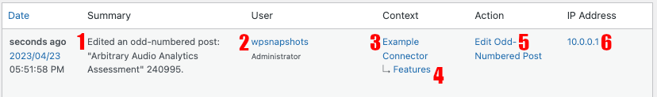

# Stream Connector - Example

This plugin adds a connector which logs when posts with odd-numbered IDs are saved.

**Contributors:** [Ben Keith](https://profiles.wordpress.org/benlk/), [10up](https://profiles.wordpress.org/10up/), [x-team](http://profiles.wordpress.org/x-team), [lukecarbis](http://profiles.wordpress.org/lukecarbis)
**Tags:** [stream](http://wordpress.org/plugins/tags/stream), [connector](http://wordpress.org/plugins/tags/connector)
**Requires at least:** 4.5
**Tested up to:** 6.2
**Stable tag:** trunk (master)
**License:** [GPLv2 or later](http://www.gnu.org/licenses/gpl-2.0.html)

## Demonstration code

1. Download this plugin, activate it.
2. Go to your posts screen (Dashboard > Posts) and find a post with an odd-numbered ID.
3. Edit the post and save it.
4. Go to your Stream connectors

## Creating your own connector

To get started:

1. Copy `connectors/example.php` into your own plugin
	1. Give your connector new values for `$name` and `get_label()`, and rename the connector class.
2. Copy the `register_stream_connector()` function from `stream-example-connector.php` into your own plugin, and hook it in via the `plugins_loaded` action.
3. Stream Connectors connect by being hooked on an action or filter. Identify which hooks you want to use, and add those to the `$actions` array.
	- Note: You can use custom hooks. For example, if you want to log a WP_CLI command in Stream, you could define a custom hook: `apply_actions( 'my_example_cli_action', [ 'some', 'important', context' ] );`
4. For each hook, Stream will call a callback method in your Connector class, named `connector_{$hook}`. These callbacks are hooked directly on the specified hook, and take all the parameters that hook receives.
5. Your connector extends the `\WP_Stream\Connector` class, and each callback calls the `self::log()` method with a set of arguments documented in the example.

The editable parts of a log entry:

1. The message, which is generated at the time the log entry is created. Changes to the `log()` method after the entry is logged will not update prior log entries.
2. The user who undertook the action. This can be modified with the sixth parameter of `log()` if necessary, such as if you're logging from a WP_CLI command.
3. The connector's name, which is a string returned by your `get_label()` method.
4. The connector's context label. A context is a string passed as the fourth parameter to the `log()` method, which must match an index in the array returned by your `get_context_labels()` method. The can be something simple like a post slug, or whatever you want.
5. The connector's action label. A connector action is a string passed as the _fifth_ parameter to the `log()` method, and does not need to match the action or hook that your connector callback is hooked on. The action string mush match an index in the array returned by your `get_action_labels()` method. This should be short but explain what action is being logged, and why that action is significant.
6. The IP address that is responsible for the event, from the point of view of the server. Proxies, WP-CLI, and other factors may make this number not accurately reflect the responsible actor's IP address.
## What if my connector gets deactivated?

Some of the information disappears:

- the connector label
- the action label

That's it.

## Changelog

- 1.0.0: Revised by [Ben Keith](https://profiles.wordpress.org/benlk/) of [10up](https://profiles.wordpress.org/10up/) to support Stream version 3
	- replaced post generation example with a simpler example that logs when odd-numbered posts are edited
	- improved documentation: now with screenshots, more inline comments, and an expanded readme.md
- 0.1.0: Initial Version by [x-team](http://profiles.wordpress.org/x-team) and [lukecarbis](http://profiles.wordpress.org/lukecarbis)
